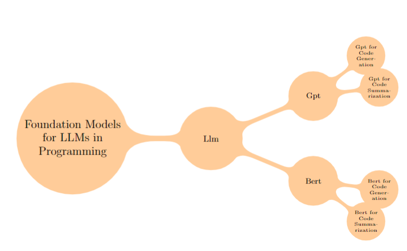

# LaTeX Mind

Just a quick and dirty Python script that takes a BibTeX `.bib` file as input and generates a mind map in the form of a TikZ-based LaTeX document, 
after reading the instructions on [overleaf](https://www.overleaf.com/learn/latex/LaTeX_Graphics_using_TikZ%3A_A_Tutorial_for_Beginners_(Part_5)%E2%80%94Creating_Mind_Maps).

The idea is to create a rough mind map for further tweaking, like this:

.

Make sure that each of your bibtex entries has a keyword entry, like this `keywords = {keyworda},`.
This will allow the program to group your sources.


## Dependencies

- bibtexparser: A Python library for parsing BibTeX files.

## Usage

1. Make sure you have the necessary dependencies installed. You can install them with pip:

```
pip install bibtexparser
```

2. Put your BibTeX file (e.g. `bibtex.bib`) in the same directory as the script.
3. Run the script:

```python
python bibtex_to_mindmap.py
```

4. The script will generate a LaTeX file called `mindmap.tex` in the same directory.

You can then paste the tikzpicture into any Latex file that imports the tikz library. Import like this:
```
\usepackage{tikz}
\usetikzlibrary{mindmap,trees}
```